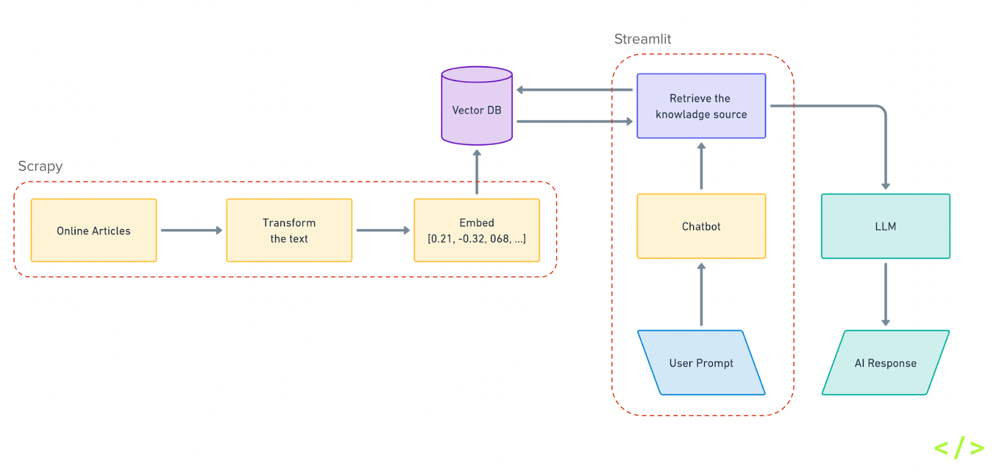

## Source Code for downloading online article to Markdown

Below is the source code for downloading online article to markdown (.md) using Newspaper3k

- Github Repo [link](https://github.com/ekkyarmandi/mojok-chatbot/blob/master/app1.py)
- Dependencies to install
  ```
  newspaper3k==0.2.8
  ```
- How to run it
  ```bash
  python app1.py
  ```
  or
  ```bash
  python3 app1.py
  ```

## Source Code for downloading online article to Spreadsheets

Below is the source code for downloading online article to as a spread sheet (.csv) using Newspaper3k and Pandas. To download it as Excel file (.xlsx) don't forget to install `openpyxl` library.

- Github Repo [link](https://github.com/ekkyarmandi/mojok-chatbot/blob/master/app2.py)
- Dependencies to install
  ```
  rich==13.8.1
  bs4==0.0.2
  scrapy==2.11.2
  pandas==2.2.2
  requests==2.32.3
  ```
- How to run it
  ```bash
  python app2.py
  ```
  or
  ```bash
  python3 app2.py
  ```

## Source Code for Data Scraping pipeline to Vector DB for LLM using RAG system


Last but not least below is the source code for data scraping pipeline to LLM RAG chatbot.

- Github Repo [link](https://github.com/ekkyarmandi/mojok-chatbot)
- Dependencies to install
  ```
  langchain==0.3.0
  langchain-chroma==0.1.4
  langchain-huggingface==0.1.0
  langchain-openai==0.2.0
  python-decouple==3.8
  requests==2.32.3
  streamlit==1.38.0
  scrapy==2.11.2
  ```
- Pip install`-r` to install all dependencies
  ```bash
  pip install -r requirements.txt
  ```
- Environtment Variable (`.env`)
  ```
  OPENAI_API_KEY = ""
  ```
- How to run Scrapy
  ```bash
  scrapy crawl mojok_co
  ```
- How to run Streamlit chatbot
  ```bash
  streamlit run chatbot.py
  ```
